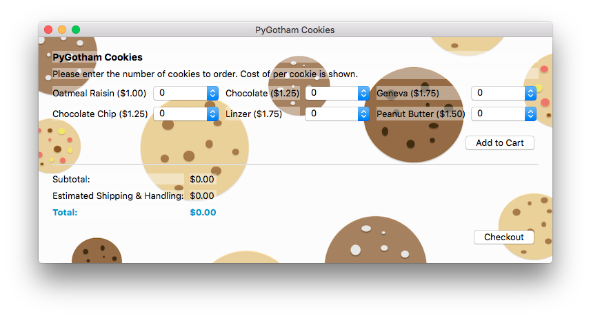

# An Intro To PyQt
All the materials from "An Intro To Building GUI Applications Using PyQt" (PyGotham 2016) talk will be available here.

Please check back after the talk for the slides. Thanks!

Update (July 18th): The presentation slides are now up, and are available under the slides subdir.

----

This is a short tutorial on how to install and build a simple GUI application using PyQt. Below is a quick snapshot of what we will be building. Let's get started!

